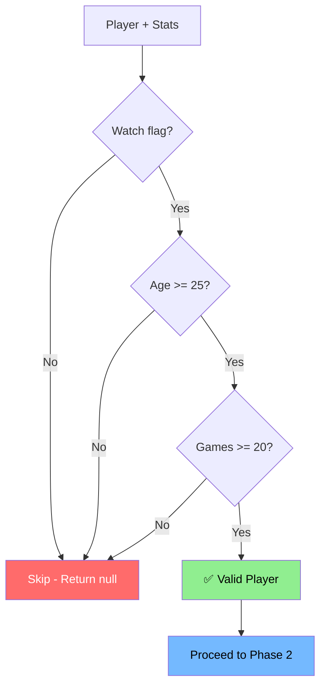
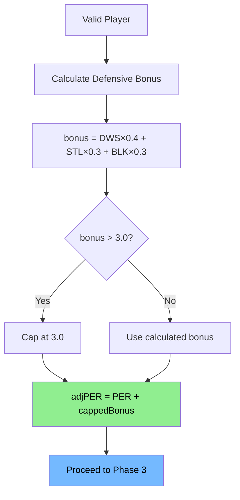
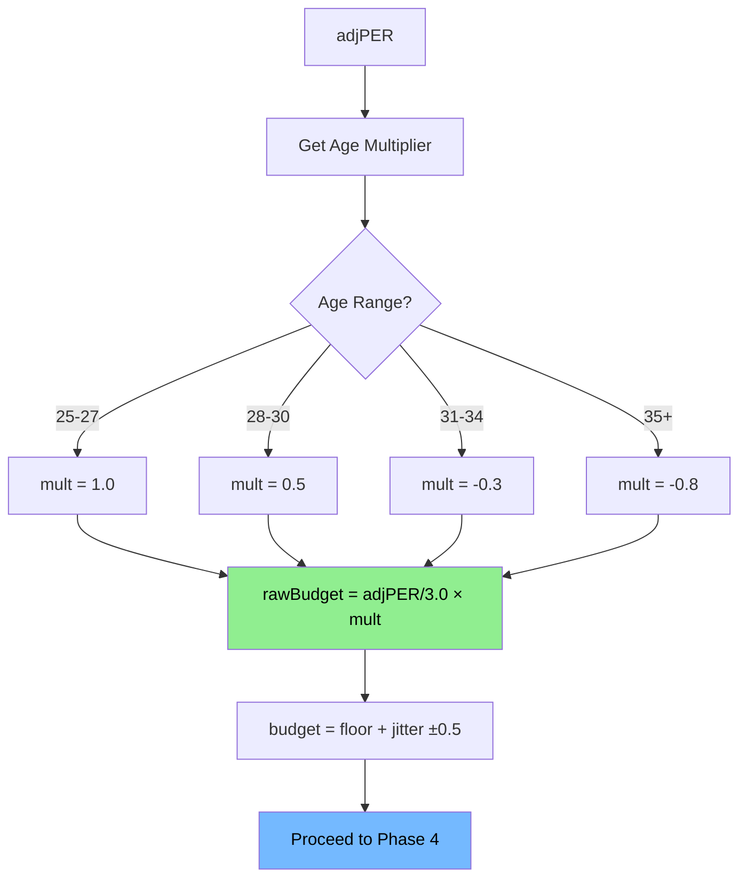
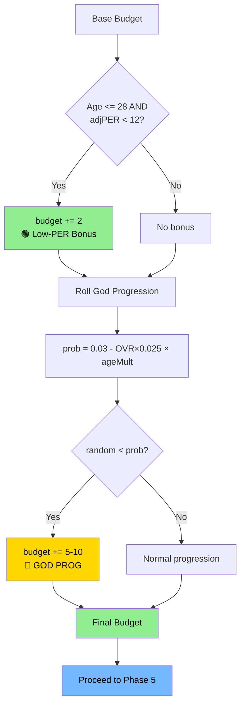
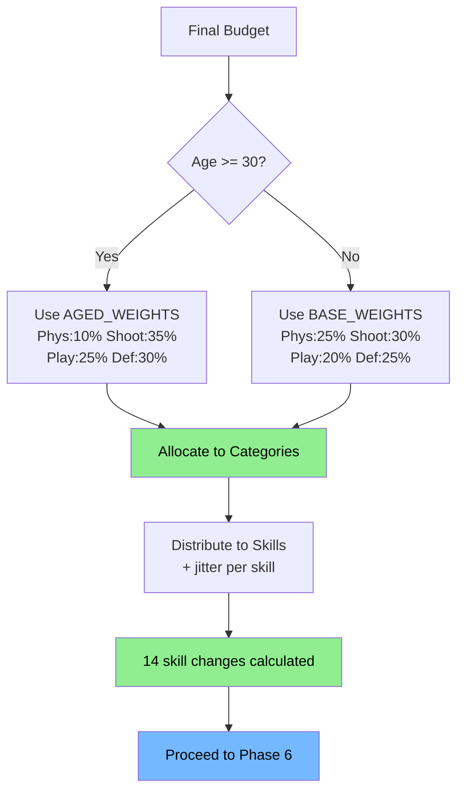
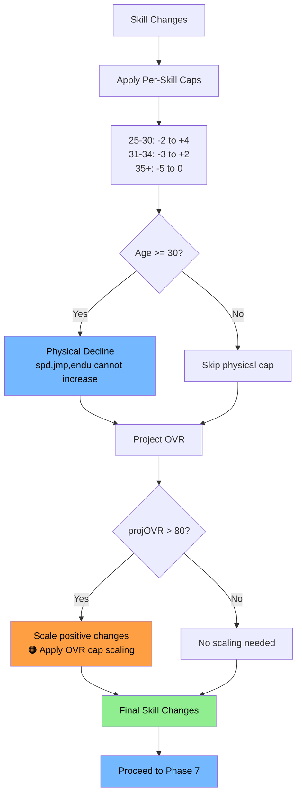
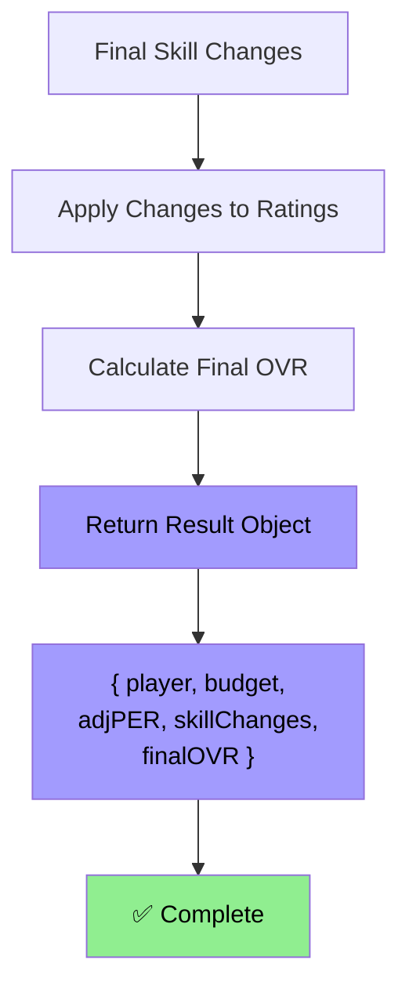

# Plan for NoEyeTest v4.0

made by [fenix](https://github.com/fearandesire)

---


### v4.0 Must Achieve
- ✅ Zero cap violations (mathematically provable)
- ✅ Defensive contribution valued (explicit DWS/STL/BLK weight)
- ✅ Single-pass execution (no mutation loops)
- ✅ Traceable logic (linear input → output)
- ✅ Tunable system (centralized config)

---

## Design Principles

1. **Immutability:** Calculate budget once, no mutation of intermediate values
2. **Single Source of Truth:** One budget pool, one age multiplier lookup, one cap pass
3. **Transparency:** Explicit formulas, named intermediates, commented rationale
4. **Fail-Safe:** Enforce caps before applying, validate inputs, log violations

---

## Mathematical Model

### Input Requirements
```javascript
{ per, dws, stl, blk, age, ovr, ratings... }
```

### Step 1: Defense-Adjusted PER
```javascript
defensiveBonus = (dws × 0.4) + (stl × 0.3) + (blk × 0.3)
cappedBonus = min(defensiveBonus, 3.0)
adjustedPER = per + cappedBonus
```

### Step 2: Age Multiplier
| Age | Multiplier |
|-----|------------|
| 25-27 | 1.0 |
| 28-30 | 0.5 |
| 31-34 | -0.3 |
| 35+ | -0.8 |

### Step 3: Base Budget
```javascript
rawBudget = (adjustedPER / 3.0) × ageMultiplier
jitter = uniform(-0.5, 0.5)
budget = floor(rawBudget + jitter)
```

### Step 4: Budget Adjustments

**Low-PER Bonus:**
```javascript
if (age <= 28 && adjustedPER < 12) budget += 2;
```

**God Progression:**
```javascript
godProbability = (0.03 - (ovr / 100) × 0.025) × (age <= 28 ? 1.0 : 0.5);
if (random() < godProbability) budget += randomInt(5, 10);
```

| OVR | Age ≤28 | Age >28 |
|-----|---------|---------|
| 60 | 1.5% | 0.75% |
| 70 | 1.25% | 0.625% |
| 80 | 0.5% | 0.25% |

### Step 5: Budget Distribution

**Category Weights:**
| Category | Base (25-29) | Aged (30+) | Skills |
|----------|--------------|------------|--------|
| Physical | 25% | 10% | spd, stre, jmp, endu |
| Shooting | 30% | 35% | fg, ft, tp, dnk |
| Playmaking | 20% | 25% | pss, drb, oiq |
| Defense | 25% | 30% | diq, ins, reb |

**Algorithm:**
```javascript
// 1. Allocate to categories
categoryBudgets[cat] = round(budget × weight)

// 2. Redistribute rounding error to priority category (defense if 30+, physical if <30)

// 3. Per-skill allocation
skillChange = round((categoryBudget / skillCount) + uniform(-0.5, 0.5))
```

### Step 6: Enforcement & Caps

**Per-Skill Caps:**
| Age Range | Min | Max |
|-----------|-----|-----|
| 25-30 | -2 | +4 |
| 31-34 | -3 | +2 |
| 35+ | -5 | 0 |

**Physical Decline (Age 30+):**
```javascript
// spd, jmp, endu cannot increase
skillChanges[physicalSkill] = min(skillChanges[physicalSkill], 0)
```

**OVR Cap (80 Max):**
```javascript
projectedOVR = calculateOVR(currentRatings + skillChanges)
if (projectedOVR > 80) {
  scaleFactor = 1 - ((projectedOVR - 80) / projectedOVR)
  // Scale positive changes only, preserve negatives
  positiveChanges *= scaleFactor
}
```

---

## Configuration Constants

```javascript
const CONFIG = {
  // Defense Adjustment
  DEFENSIVE_WEIGHTS: { dws: 0.4, stl: 0.3, blk: 0.3 },
  DEFENSIVE_BONUS_CAP: 3.0,

  // Budget Calculation
  BASE_DIVISOR: 3.0,
  JITTER_RANGE: 0.5,
  AGE_MULTIPLIERS: {
    25: 1.0, 26: 1.0, 27: 1.0,
    28: 0.5, 29: 0.5, 30: 0.5,
    31: -0.3, 32: -0.3, 33: -0.3, 34: -0.3,
    35: -0.8 // 36+ same
  },
  LOW_PER_BONUS: { ageThreshold: 28, perThreshold: 12, bonus: 2 },
  GOD_PROGRESSION: {
    baseRate: 0.03,
    ovrPenalty: 0.025,
    oldAgeMultiplier: 0.5,
    ageThreshold: 28,
    bonusRange: [5, 10]
  },

  // Distribution
  BASE_WEIGHTS: { physical: 0.25, shooting: 0.30, playmaking: 0.20, defense: 0.25 },
  AGED_WEIGHTS: { physical: 0.10, shooting: 0.35, playmaking: 0.25, defense: 0.30 },
  CATEGORY_SKILLS: {
    physical: ['spd', 'stre', 'jmp', 'endu'],
    shooting: ['fg', 'ft', 'tp', 'dnk'],
    playmaking: ['pss', 'drb', 'oiq'],
    defense: ['diq', 'ins', 'reb']
  },

  // Caps & Limits
  SKILL_CAPS: {
    '25-30': { min: -2, max: 4 },
    '31-34': { min: -3, max: 2 },
    '35+': { min: -5, max: 0 }
  },
  PHYSICAL_DECLINE_AGE: 30,
  PHYSICAL_SKILLS: ['spd', 'jmp', 'endu'],
  OVR_HARD_CAP: 80,

  // Validation
  MIN_AGE: 25,
  MIN_GAMES: 20,

  // Debug
  DEBUG: false,
  NOTIFY_GOD_PROGS: true,
  NOTIFY_ALL_PROGS: false
};
```

---

## Logic Flow (Pseudo-Code)

```javascript
async function progressPlayer(player) {
  // 1. Validate
  if (!player.watch || player.age < 25) return null;
  const stats = getPlayerStats(player, previousSeason);
  if (!stats || stats.gp < MIN_GAMES) return null;

  // 2. Defense-Adjusted PER
  const defensiveBonus = min(
    (stats.dws * 0.4) + (stats.stl * 0.3) + (stats.blk * 0.3),
    3.0
  );
  const adjustedPER = stats.per + defensiveBonus;

  // 3. Budget Calculation
  const ageMultiplier = getAgeMultiplier(player.age);
  let budget = floor((adjustedPER / 3.0) * ageMultiplier + uniform(-0.5, 0.5));

  // 4. Adjustments
  if (player.age <= 28 && adjustedPER < 12) budget += 2;
  if (random() < godThreshold(player.ovr, player.age)) budget += randomInt(5, 10);

  // 5. Distribution
  const weights = player.age >= 30 ? AGED_WEIGHTS : BASE_WEIGHTS;
  const categoryBudgets = distributeToCatgories(budget, weights);
  const skillChanges = distributeToSkills(categoryBudgets, player.age);

  // 6. Enforcement
  enforceSkillCaps(skillChanges, player.age);
  enforcePhysicalDecline(skillChanges, player.age);
  const projectedOVR = projectOVR(player.ratings, skillChanges);
  if (projectedOVR > 80) scaleChangesToOVRCap(skillChanges, projectedOVR);

  // 7. Apply
  applyChanges(player.ratings, skillChanges);
  return { player, budget, adjustedPER, skillChanges, finalOVR: calculateOVR(player.ratings) };
}
```

---

## Test Cases

| Case | Input | Expected |
|------|-------|----------|
| **Elite Scorer** | age:26, per:28, dws:0.5, stl:0.3, blk:0.1, ovr:75 | adjPER≈28.2, budget≈9, OVR≤80 |
| **Defensive Anchor** | age:28, per:12, dws:5, stl:2, blk:2, ovr:68 | adjPER≈15 (capped), budget≈4-5 (+low-PER bonus) |
| **Aging Veteran** | age:33, per:18, dws:2, stl:1, blk:0.5, ovr:76 | budget≈-2, physicals decline, OVR decreases |
| **OVR Cap** | age:27, per:30, dws:3, stl:1.5, blk:1, ovr:78 | budget≈10-12, scaled to OVR=80 exactly |
| **God Prog** | age:25, per:15, dws:1, stl:0.8, blk:0.5, ovr:65 | budget +5-10 if triggered, respects per-skill caps |

### Validation Checklist
- [ ] All test cases pass
- [ ] Zero OVR cap violations in 1000 player sim
- [ ] God progs at ~1-3% rate
- [ ] Defensive specialists progress fairly
- [ ] Physical decline visible in 30+ players

---

## Implementation Phases

| Phase | Goal | Deliverable | Success Criteria |
|-------|------|-------------|------------------|
| **1** | Foundation | CONFIG, utilities, validation, logging | Script runs, logs flagged players |
| **2** | Defense-Adjusted PER | `calculateDefensiveBonus()` | Elite defender: +3.0, poor: +0.5 |
| **3** | Budget Calculation | Budget values per player | 26yo/PER20: 6-7, 33yo/PER20: -2, god ~2% |
| **4** | Distribution | Skill-level changes | Budget 10 → ~0-1 per skill, sum conserved |
| **5** | Enforcement | Capped changes | No skill/OVR violations, regression preserved |
| **6** | Integration | Full script with notifications | Players update, no runtime errors |
| **7** | Testing & Tuning | Production v4.0 | All validation passes |

---

## Tuning Guide

| Goal | Adjustment |
|------|------------|
| ↑ Progression | Lower BASE_DIVISOR (3.0→2.5), raise age multipliers |
| ↑ Defense reward | Raise DWS weight (0.4→0.5), raise DEFENSIVE_BONUS_CAP |
| ↓ Physical decline | Raise 30+ multiplier (-0.3→-0.1) |
| ↓ God prog frequency | Lower baseRate (0.03→0.01), raise ovrPenalty |

---

## Decisions Made

| Question | Decision | Rationale |
|----------|----------|-----------|
| Position-specific weights? | Skip v4.0 | BBGM handles in OVR calc |
| God progs bypass caps? | No | Budget increase, but respect per-skill caps |
| Handle rookies (<25)? | Out of scope | Focus on fixing 26+ issues |
| Log all progs? | Toggle (default: god only) | Avoid notification spam |

---

## Progression Logic Diagrams

### Phase 1: Input Validation



### Phase 2: Defense-Adjusted PER



### Phase 3: Budget Calculation



### Phase 4: Budget Adjustments



### Phase 5: Budget Distribution



### Phase 6: Enforcement & Caps



### Phase 7: Output & Application



---

## Key Formulas Reference

```javascript
// Defense-Adjusted PER
adjPER = per + min((dws × 0.4) + (stl × 0.3) + (blk × 0.3), 3.0)

// Base Budget
budget = floor((adjPER / 3.0) × ageMultiplier + uniform(-0.5, 0.5))

// God Probability
godProb = (0.03 - (ovr / 100) × 0.025) × (age ≤ 28 ? 1.0 : 0.5)

// OVR Scaling
scaleFactor = 1 - ((projectedOVR - 80) / projectedOVR)
```


