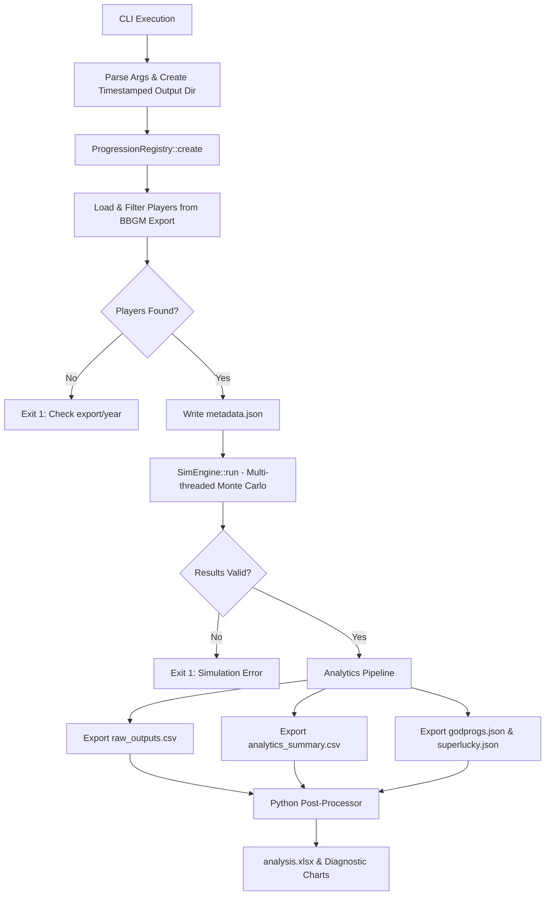

# Progbox v2
a ***Monte Carlo Progression Simulator***

A parallelised C++ Monte Carlo engine for simulating and analysing player progression in [BasketballGM](https://zengm.com/basketball/). Runs hundreds or thousands of independent progression passes over a roster, then produces aggregated statistics and tuner-focused diagnostic charts.

### The Progression Scripts
This engine ports the following NoEyeTest (NET) progression scripts into native C++:
- [NET v3.2 (archive, dev v3.2)](https://github.com/fearandesire/NoEyeTest/blob/dev/src/NoEyeTest.js)
- [NET v4 (updatealgo)](https://gist.github.com/fearandesire/fa7ddef9be41be66e1b9639b51bb88d6) 
- [modified for NET v4.1 (dev-v4.1)](https://github.com/shawnmalik1/NoEyeTest-v4/blob/main/noeyetest_progs_v4.js)

All into a single codebase so we don't have to keep switching branches!!

### Why C++?
The previous Python implementation required maintaining multiple branching scripts and config dictionaries to swap between progression versions. Further, GIL meant i couldn't do my usual multithreading shenanigans simply. This C++ rewrite solves that by using a **Algorithm Registry Pattern**. Progression scripts are now self-contained C++ objects. 

Adding a new script requires zero changes to the core engine and all you have to do is register it. Best of all, It gives you a single, compact binary you can plug and play to your heart's content in any frontend/backend as long as you have an operating system that supports it. Currently only tested for Linux and WSL (ubuntu 20 and above, we do need filesystem support!!).

---

## Execution Flow



---

## Project Structure

```text
.
├── src/
│   ├── main.cpp                 # Entry point & CLI parsing
│   ├── sim_engine.hpp/cpp       # Monte Carlo harness
│   ├── analytics.hpp/cpp        # CSV/JSON export logic
│   ├── progression_registry.hpp # Auto-discovery of progression scripts
│   ├── i_progression.hpp        # Interface all scripts must implement
│   ├── core_types.hpp           # PlayerState, PlayerMeta, RunResult
│   ├── analysis.py              # Python post-processor (Charts/Excel)
│   └── scripts/
│       ├── v321_progression.hpp # NET v3.2.1 implementation
│       └── v41_progression.hpp  # NET v4.1 implementation
├── data/
│   ├── export.json              # BBGM league export
│   └── teaminfo.json            # Team ID to Name mapping
├── outputs/
│   └── {YYYYMMDDHHMMSS}/       # Timestamped run directory
├── buildprogbox.sh
└── CMakeLists.txt
```

---

## Setup

**C++ Engine:**
- Requires C++17 or higher.
- Dependencies: `nlohmann/json` (header-only).
- Compile using your preferred build system (CMake recommended).

quick script for building and running if you're on linux or wsl: `./buildprogbox.sh`

**Python Post-Processor:**
Required only if you want the Excel workbook and diagnostic charts.
```bash
pip install numpy pandas scipy matplotlib tqdm openpyxl
```

Place your BBGM league export at `data/export.json` and team metadata at `data/teaminfo.json`.

---

## Running a Simulation

Configuration is handled entirely via CLI arguments. No source code editing needed.

```bash
./progbox data/export.json data/teaminfo.json ./outputs \
  -v v41 \
  -r 1000 \
  -y 2021 \
  -w 12 \
  -s 69
```

| Argument | Description | Default |
|----------|-------------|---------|
| `export.json` | Path to BBGM player export | *(Required)* |
| `teaminfo.json` | Path to team info lookup | *(Required)* |
| `output_dir` | Base directory for results | *(Required)* |
| `-v, --version` | Progression script ID | `v321` |
| `-r, --runs` | Number of Monte Carlo passes | `1000` |
| `-y, --year` | Season year (for age calculation) | `2021` |
| `-w, --workers` | Thread pool size | `hardware_concurrency` |
| `-s, --seed` | Master RNG seed (`0` = random) | `0` |

*Note: The master RNG derives each run's seed, so the same `seed` always produces the same set of simulations regardless of `workers`.*

---

## Output Files

All raw numeric outputs are generated natively in C++. The C++ engine applies a strict filter pipeline: players must have `tid >= -1`, non-empty stats, `PER > 0`, and `age >= 25`.

### `outputs/{RUN_TS}/metadata.json`
Reproducibility tracking. Records the exact CLI args, progression version, CalVer timestamp, and seed used.

### `outputs/{RUN_TS}/raw_outputs.csv`
Long-format table with one row per player × run.
| Column | Description |
|--------|-------------|
| `Run` / `RunSeed` | Simulation index and its specific RNG seed |
| `Name`, `Team`, `Age`, `PlayerID` | Player metadata |
| `Baseline` | Player's OVR before progression |
| `Ovr` | Simulated OVR after progression |
| `Delta` / `PctChange` / `AboveBaseline` | Outcome metrics |
| `PER`, `DWS`, `EWA` | Input stats |
| `dIQ` … `3Pt` | Final simulated attribute values (15 attrs) |

### `outputs/{RUN_TS}/analytics_summary.csv`
Per-player aggregated distributions computed in C++ (mean, std dev, min/max, Q10/Q25/Q75/Q90 quantiles, and % of runs above baseline).

### `outputs/{RUN_TS}/godprogs.json`
Array of every rare god-progression event. Fields: `name`, `run_seed`, `age`, `ovr`, `bonus`, `chance`.

### `outputs/{RUN_TS}/superlucky.json`
Object mapping `player_name → total_god_prog_count` across all runs.

---

## Analysis & Charts (Python Post-Processor)

The C++ engine automatically invokes `src/analysis.py` after exporting CSVs. This script reads the raw outputs and generates an `analysis.xlsx` workbook and `charts/` directory.

All thresholds and splits are derived dynamically from the dataset.

1. **Age Outcome Profiles:** KDE density curves per age group to check if age tiers produce meaningfully different outcome shapes.
2. **Progression Response Curve:** Composite score → OVR delta mapping (decile buckets with IQR error bars) to find dead zones.
3. **Physical vs Skill Gate Check:** Grouped bars comparing physical attr decay vs skill attr decay across age tiers.
4. **Attribute Delta Heatmap:** 14-row × 3-column grid (attrs × age groups) showing net gain/decline at a glance.
5. **Player Outcome Certainty:** Horizontal spans (Q10 to Q90) per player to identify who has locked-in outcomes vs RNG-dominated outcomes.
6. **Stat Weight Reality Check:** Theoretical composite weights vs actual partial R² shares to detect over/under-driving stats.
7. **Age × Performance Matrix:** 3×3 heatmap (Age Group × Performance Tertile) showing mean deltas and sample sizes.

---

## Adding a New Progression Script

You never need to touch `main.cpp`, `sim_engine.hpp`, or `analytics.hpp`. 

1. Create `src/scripts/vXXX_progression.hpp` implementing `IProgressionStrategy`.
2. Include it in `progression_registry.hpp`.
3. Add a factory entry to the registry vector:

```cpp
// In progression_registry.hpp
#include "scripts/vXXX_progression.hpp"

// Inside ProgressionRegistry::entries()
{
    "vXXX",
    "VX.X - Description of your script",
    []() -> std::unique_ptr<IProgressionStrategy> { return std::make_unique<VXXXProgression>(); }
},
```

Rebuild. The CLI (`-h`), registry, and engine will automatically discover and support `./progbox ... -v vXXX`.
