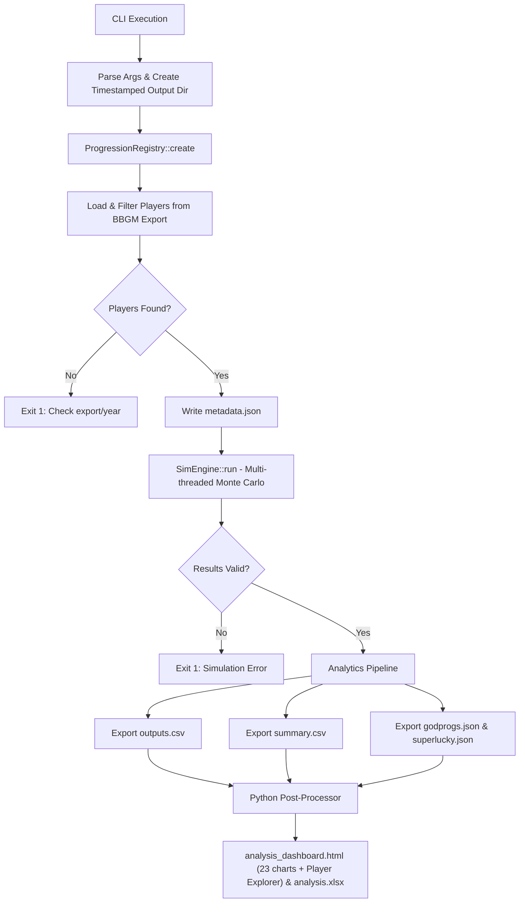

# Progbox v2
*A highly parallelised, Monte Carlo Progression Simulator for custom [BasketballGM](https://play.basketball-gm.com/) Prog scripts*

[](https://en.cppreference.com/w/cpp/20)
[](https://python.org)

Progbox is a native C++ engine that runs hundreds or thousands of independent progression passes over a BasketballGM roster. It outputs aggregated statistics and tuner-focused diagnostic charts, serving as a powerful sandbox for balancing progression algorithms.

### The Progression Scripts
This engine ports the following NoEyeTest (NET) progression scripts into native C++:
- [**NET v3.2**](https://github.com/fearandesire/NoEyeTest/blob/dev/src/NoEyeTest.js) (python ver branch: dev_v3.2) 
- [**NET v4**](https://gist.github.com/fearandesire/fa7ddef9be41be66e1b9639b51bb88d6) (python ver branch: updatealgo) 
- [**NET v4.1**](https://github.com/shawnmalik1/NoEyeTest-v4/blob/main/noeyetest_progs_v4.js) (python ver branch: dev_v4.1) 

With this rewrite, all scripts live in a single codebase. no more switching branches to test different algorithms.

### Why C++?
The previous Python implementation suffered from two limitations: maintaining branching config dictionaries, and the GIL blocking true multithreading. Progbox solves both using a **Registry Pattern**. 

Progression scripts are now self-contained C++ objects. Adding a new script requires zero changes to the core engine. The result is a single, compact binary you can plug into any frontend/backend pipeline (tested on Linux and WSL, Ubuntu 20+ as I require std::filesystem).

---

## Execution Flow



---

## Project Structure

```text
.
├── src/
│   ├── main.cpp                 # Entry point, CLI parsing, orchestration
├── scripts/
│   ├── v0_progression.hpp       # Base BBGM prog script implementation
│   ├── v321_progression.hpp     # NET v3.2.1 implementation
│   ├── v41_progression.hpp      # NET v4.1 implementation
│   └── v43_progression.hpp      # experimental version of a candidate new progression script
├── include/
│   ├── sim_engine.hpp           # Thread-pool Monte Carlo harness
│   ├── analytics.hpp            # Raw CSV/JSON export logic
│   ├── progression_registry.hpp # Auto-discovery of progression scripts (DO NOT EDIT, generate_progression_registry.py handles this)
│   ├── i_progression.hpp        # Interface all scripts must implement
|   ├── ovr_math.hpp             # posted BBGM OVR calculation logic
|   ├── json.hpp                 # https://github.com/nlohmann/json
|   ├── progress.hpp             # factory progress bars!!
│   └── core_types.hpp           # shared data structures
├── cmake/
│   └── generate_progression_registry.py
├── tools/
│   └── analysis.py              # Python post-processor (Excel/Charts)
├── data/
│   ├── export.json              # BBGM league export
│   └── teaminfo.json            # Team ID to Name mapping
├── outputs/
│   └── {YYYYMMDDHHMMSS}/        # Timestamped run directory
├── config.json                  # run settings
└── CMakeLists.txt
```

---

## Setup

### C++ Engine
- **Compiler:** C++20 or higher (GCC 13+ / Clang 17+).
- **Dependencies:** [nlohmann/json](https://github.com/nlohmann/json) (header-only, already included in the include folder).
- **Build:** 
  ```bash
  # Quick build (Linux/WSL)
  chmod +x buildprogbox.sh && ./buildprogbox.sh
  
  # Or via CMake directly
  mkdir build && cd build
  cmake .. && make -j$(nproc)
  ```

### Python Post-Processor
Required only for the HTML dashboard and Excel workbook.
```bash
pip install numpy pandas scipy plotly openpyxl
```

### Data
Download your league export locally, and point config.json to it. See Configuration.

---

## Running a Simulation

### Configuration (via file)

Settings resolve in three layers, each overriding the one below:

    built-in defaults  <  config file  <  command-line flags

The config file is `./progbox.config.json` if present, or any path passed with `-c/--config`. An explicit `--config` that can't be read is a hard error; the implicit default file is silently skipped when absent. Every key is optional, and if omitted you fall back to engine defaults, which i do not recommend.

```json
{
  "export_path": "data/export.json",
  "teaminfo_path": "data/teaminfo.json",
  "output_dir": "outputs",
  "version": "v43",
  "runs": 500,
  "year": 2021,
  "workers": 0,
  "seed": 69,
  "run_analysis": true,
  "analysis_script": "tools/analysis.py"
}
```

### Configuration (via CLI)

The positional `export.json teaminfo.json output_dir` args are optional when the
config file supplies `export_path`, `teaminfo_path`, and `output_dir`. The Python
interpreter is not configurable, as it auto-selects `python3` (POSIX) or `python`
(Windows).

```bash
./progbox data/export.json data/teaminfo.json ./outputs \
  -v v41 \
  -r 1000 \
  -y 2021 \
  -w 12 \
  -s 69
```

| Argument | Description | Default |
|----------|-------------|---------|
| `export.json` | BBGM player export (or `export_path` in config) | *(required)* |
| `teaminfo.json` | Team info lookup (or `teaminfo_path` in config) | *(required)* |
| `output_dir` | Base directory for results (or `output_dir` in config) | *(required)* |
| `-c, --config` | Config file path | `progbox.config.json` |
| `-v, --version` | Progression script ID | `v321` |
| `-r, --runs` | Monte Carlo passes | `500` |
| `-y, --year` | Season year (clamped to export's latest) | `2021` |
| `-w, --workers` | Thread pool size (`0` = auto) | `hardware_concurrency` |
| `-s, --seed` | Master RNG seed (`0` = random) | `69` |
| `--analysis` / `--no-analysis` | Run/skip Python post-processing | `run_analysis` (true) |

*Note: The master RNG derives each run's seed, so the same `seed` always produces the exact same set of simulations. Important for reproducibility of the monte carlo simulations. Otherwise, the simulations would not hold water mathematically and practically for any form of cross-script or tuning comparison.*

Running the python post-processing is now OPTIONAL. the CLI will prompt you.
---

## Output Files

The C++ engine applies a strict filter pipeline: players must have `tid >= -1`, non-empty stats, `PER > 0`, and for now, as young players are out of scope for our progression scripts, `age >= 25`.

All outputs land in `outputs/{RUN_TS}/`:

- `metadata.json` contains CLI/config args, version, CalVer stamp, and the **effective**
  year and seed actually used.
- `raw/outputs.csv` is a dump of long-format simulation output with one row per player × run.
- `raw/input.csv` is a dump of the simulation inputs with one row per player: baseline attributes + input stats.
- `raw/godprogs.json`, `raw/superlucky.json` are the god-prog event log and per-player tallies, if such a mechanism exists in the scripts.

If post-processing runs, `analysis.py` adds:
- `analysis_dashboard.html`, which is a self-contained dashboard (23 charts across 8
  sections + the interactive Player Explorer). See `charts.md`.
- `analysis.xlsx`, which is a styled workbook, and can be skipped with `--no-excel`; the heavy per-run
  "All Runs" sheet is opt-in via `--full-excel` (default off)

---

## Analysis & Charts (`analysis.py` Post-Processor)

After C++ exports the data, if you have opted for python post-processing, it automatically invokes `tools/analysis.py`. This script generates a styled `analysis.xlsx` workbook and a static html diagnostic dashboard in the output directory. Please refer to charts.md for more information on how to interpret each chart.

## Comparing scripts

Hand `analysis.py` two or more run directories to get a head-to-head instead of a
single-run deep-dive:

```bash
python tools/analysis.py outputs/RUN_v321 outputs/RUN_v43 [more...] [--ceiling 84]
```

This writes `comparison_dashboard.html` and `comparison_scorecard.csv` next to the first run, containing a KPI scorecard (PeakAge, PrimeSep, PrimeSep(OVRadj), DeclineSlope, Drift, MedianσΔ, ICC, KendallW, P99, %>cap, GodProg/run) plus overlay charts for the age curve, talent separation, ceiling, noise, and attribute fingerprint.

## Adding a New Progression Script

You never need to touch the engine code or manually edit any registry files. The build system now automatically discovers new scripts.

**1. Create the implementation** in `scripts/vXXX_progression.hpp`:

```cpp
/// @progbox-register
///   id: vXXX
///   name: "VX.X - Short description of your script"
///   class: VXXXProgression
/// @end-progbox-register

#include "i_progression.hpp"

namespace progbox {

class VXXXProgression final : public IProgressionStrategy {
public:
    [[nodiscard]] std::string version() const noexcept override { 
        return "vXXX"; 
    }
    
    ProgressionResult progress_player(
        const PlayerState& player,
        const PlayerStats& stats, 
        std::mt19937& rng, 
        int64_t run_seed
    ) const override {
        // Your algorithm here
        ProgressionResult result;
        // ...
        return result;
    }
};

} // namespace progbox
```

**2. Rebuild.** 

The CLI (`-h`), registry, and engine will automatically discover and support `./progbox ... -v vXXX`.

> **Note:** The `name:` field *must* be wrapped in quotes. Do not manually edit `generated_progression_registry.hpp`, as your changes will be overwritten on the next build.

---

<p align="center">
  <a href="https://github.com/akshayexists">
    
  </a>
  <br />
  <sub>
    <b>akshayexists</b> • © 2026
  </sub>
</p>
