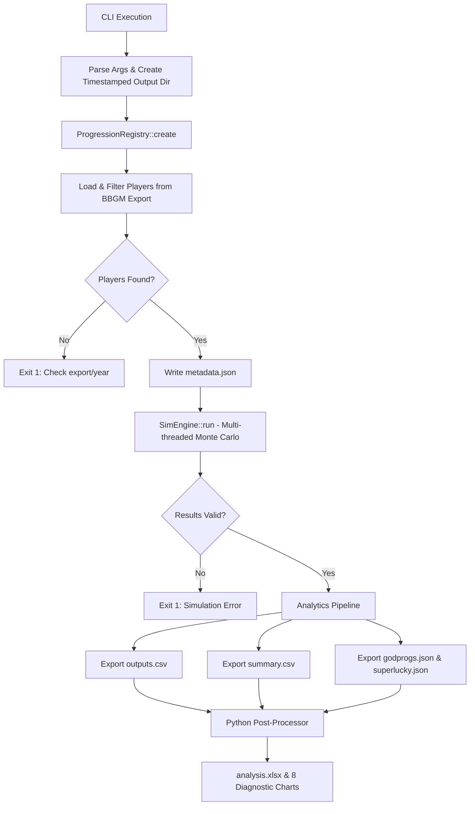

# Progbox v2
*A highly parallelised, Monte Carlo Progression Simulator for custom [BasketballGM](https://play.basketball-gm.com/) Prog scripts*

[](https://en.wikipedia.org/wiki/C%2B%2B17)
[](https://python.org)

Progbox is a native C++ engine that runs hundreds or thousands of independent progression passes over a BasketballGM roster. It outputs aggregated statistics and tuner-focused diagnostic charts, serving as a powerful sandbox for balancing progression algorithms.

### The Progression Scripts
This engine ports the following NoEyeTest (NET) progression scripts into native C++:
- [**NET v3.2**](https://github.com/fearandesire/NoEyeTest/blob/dev/src/NoEyeTest.js) (python ver branch: dev_v3.2) 
- [**NET v4**](https://gist.github.com/fearandesire/fa7ddef9be41be66e1b9639b51bb88d6) (python ver branch: updatealgo) 
- [**NET v4.1**](https://github.com/shawnmalik1/NoEyeTest-v4/blob/main/noeyetest_progs_v4.js) (python ver branch: dev_v4.1) 

With this rewrite, all scripts live in a single codebase. no more switching branches to test different algorithms.

### Why C++?
The previous Python implementation suffered from two limitations: maintaining branching config dictionaries, and the GIL blocking true multithreading. Progbox solves both using a **Registry Pattern**. 

Progression scripts are now self-contained C++ objects. Adding a new script requires zero changes to the core engine. The result is a single, compact binary you can plug into any frontend/backend pipeline (tested on Linux and WSL, Ubuntu 20+ as I require std::filesystem).

---

## Execution Flow



---

## Project Structure

```text
.
├── src/
│   ├── main.cpp                 # Entry point, CLI parsing, orchestration
├── scripts/
│   ├── v321_progression.hpp     # NET v3.2.1 implementation
│   └── v41_progression.hpp      # NET v4.1 implementation
├── include/
│   ├── sim_engine.hpp           # Thread-pool Monte Carlo harness
│   ├── analytics.hpp            # Raw CSV/JSON export logic
│   ├── progression_registry.hpp # Auto-discovery of progression scripts, (TO EDIT WHEN NEW SCRIPTS ARE ADDED)
│   ├── i_progression.hpp        # Interface all scripts must implement
|   ├── ovr_math.hpp             # posted BBGM OVR calculation logic
|   ├── json.hpp                 # https://github.com/nlohmann/json
|   ├── progress.hpp             # factory progress bars!!
│   └── core_types.hpp           # shared data structures
├── cmake/
│   └── generate_progression_registry.py
├── tools/
│   └── analysis.py              # Python post-processor (Excel/Charts)
├── data/
│   ├── export.json              # BBGM league export
│   └── teaminfo.json            # Team ID to Name mapping
├── outputs/
│   └── {YYYYMMDDHHMMSS}/        # Timestamped run directory
├── buildprogbox.sh              # Quick build script
└── CMakeLists.txt
```

---

## Setup

### C++ Engine
- **Compiler:** C++17 or higher (GCC/Clang recommended).
- **Dependencies:** [nlohmann/json](https://github.com/nlohmann/json) (header-only, already included in the include folder).
- **Build:** 
  ```bash
  # Quick build (Linux/WSL)
  chmod +x buildprogbox.sh && ./buildprogbox.sh
  
  # Or via CMake directly
  mkdir build && cd build
  cmake .. && make -j$(nproc)
  ```

### Python Post-Processor
Required only for the Excel workbook and diagnostic charts.
```bash
pip install numpy pandas scipy matplotlib openpyxl
```

### Data
Place your BBGM league export at `data/export.json` and team metadata at `data/teaminfo.json`.

---

## Running a Simulation

Configuration is handled entirely via CLI arguments. No source code editing required.

```bash
./progbox data/export.json data/teaminfo.json ./outputs \
  -v v41 \
  -r 1000 \
  -y 2021 \
  -w 12 \
  -s 69
```

| Argument | Description | Default |
|----------|-------------|---------|
| `export.json` | Path to BBGM player export | *(Required)* |
| `teaminfo.json` | Path to team info lookup | *(Required)* |
| `output_dir` | Base directory for results | *(Required)* |
| `-v, --version` | Progression script ID | `v321` |
| `-r, --runs` | Number of Monte Carlo passes | `1000` |
| `-y, --year` | Season year (for age calculation) | `2021` |
| `-w, --workers` | Thread pool size (`0` = auto) | `hardware_concurrency` |
| `-s, --seed` | Master RNG seed (`0` = random) | `0` |

*Note: The master RNG derives each run's seed, so the same `seed` always produces the exact same set of simulations. Important for reproducibility of the monte carlo simulations. Otherwise, the simulations would not hold water mathematically and practically for any form of cross-script or tuning comparison.*

Running the python post-processing is now OPTIONAL. the CLI will prompt you.
---

## Output Files

The C++ engine applies a strict filter pipeline: players must have `tid >= -1`, non-empty stats, `PER > 0`, and `age >= 25`.

All outputs are written to `outputs/{RUN_TS}/`:

### `metadata.json`
Reproducibility tracking. Records the exact CLI args, progression version, CalVer timestamp, and seed used.

### `raw_outputs.csv`
Long-format table with one row per player × run.
| Column Group | Description |
|--------|-------------|
| `Run`, `RunSeed` | Simulation index and its specific RNG seed |
| `Name`, `Team`, `Age`, `PlayerID` | Player metadata |
| `Baseline`, `Ovr` | OVR before and after progression |
| `Delta`, `PctChange`, `AboveBaseline` | Outcome metrics |
| `PER`, `DWS`, `EWA` | Input stats driving the algorithm |
| `dIQ` … `3Pt` | Final simulated attribute values (15 attrs) |

### `analytics_summary.csv`
Per-player aggregated distributions computed natively in C++ (mean, std dev, min/max, Q10/Q25/Q75/Q90 quantiles, and % of runs above baseline).

### `godprogs.json` & `superlucky.json`
Logs every rare god-progression event (`name`, `run_seed`, `age`, `ovr`, `bonus`, `chance`) and a summary map of `player_name → total_god_prog_count`.

---

## Analysis & Charts (`analysis.py` Post-Processor)

After C++ exports the data, if you have opted for python post-processing, it automatically invokes `tools/analysis.py`. This script generates a styled `analysis.xlsx` workbook and an 8-chart diagnostic dashboard in `charts/`. The charts are specific to v4.1 mostly, but are easily modifiable.

All thresholds and splits are derived dynamically from the dataset:

1. **Age Tier Profiles:** KDE density curves per age group checking if tiers produce distinct shapes.
2. **Composite Calibration:** Observed mean delta vs composite score, overlaid on the formula's theoretical lo/hi band.
3. **Physical vs Cognitive:** Mean attribute delta for physical vs skill groups per age tier (validates age-gate restrictions).
4. **Player Reliability:** Scatter plot (Mean Delta vs Std Delta) identifying Boom-or-Bust vs Locked-In players.
5. **Attribute Heatmap:** Player × Attribute grid showing net movement, highlighting physical decline gates.
6. **Composite Tier Separation:** Violin plots checking if within-age-group composite quartiles strictly order outcomes.
7. **Outcome Range:** Horizontal span bars (P5/P25/P50/P75/P95) showing realistic floors and ceilings per player.
8. **Convergence:** Running mean delta ± MCSE for high-variance players to validate if `runs` is high enough.

---

## Adding a New Progression Script

You never need to touch the engine code or manually edit any registry files. The build system now automatically discovers new scripts.

**1. Create the implementation** in `scripts/vXXX_progression.hpp`:

```cpp
/// @progbox-register
///   id: vXXX
///   name: "VX.X - Short description of your script"
///   class: VXXXProgression
/// @end-progbox-register

#include "i_progression.hpp"

namespace progbox {

class VXXXProgression final : public IProgressionStrategy {
public:
    [[nodiscard]] std::string version() const noexcept override { 
        return "vXXX"; 
    }
    
    ProgressionResult progress_player(
        const PlayerState& player, 
        std::mt19937& rng, 
        int64_t run_seed
    ) const override {
        // Your algorithm here
        ProgressionResult result;
        // ...
        return result;
    }
};

} // namespace progbox
```

**2. Rebuild.** 

The CLI (`-h`), registry, and engine will automatically discover and support `./progbox ... -v vXXX`.

> **Note:** The `name:` field *must* be wrapped in quotes. Do not manually edit `generated_progression_registry.hpp`, as your changes will be overwritten on the next build.